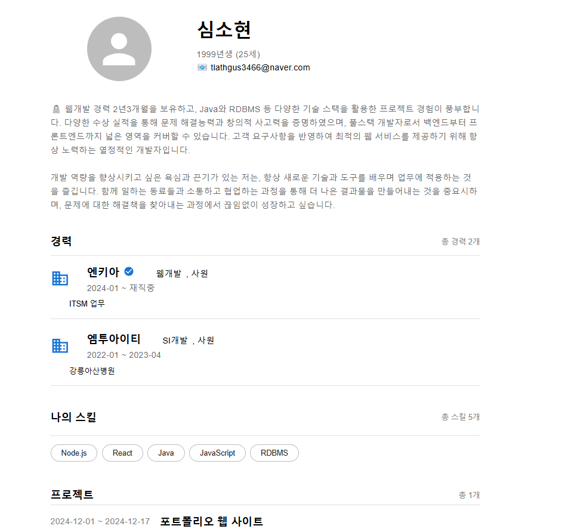
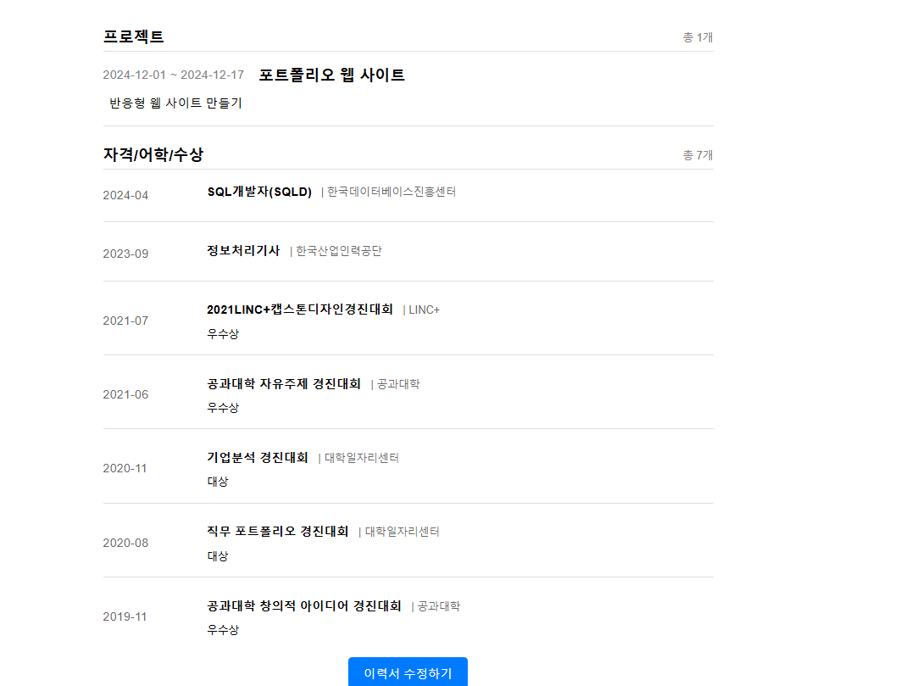
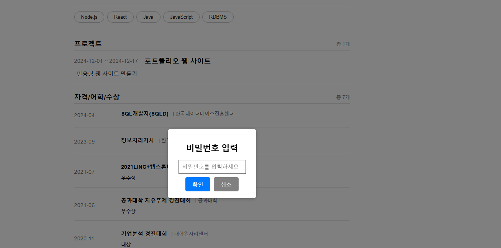
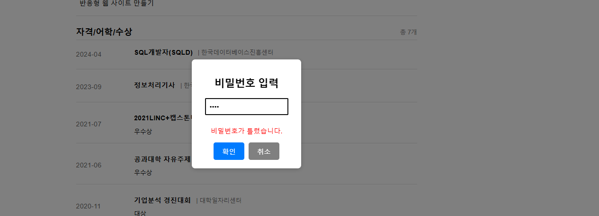
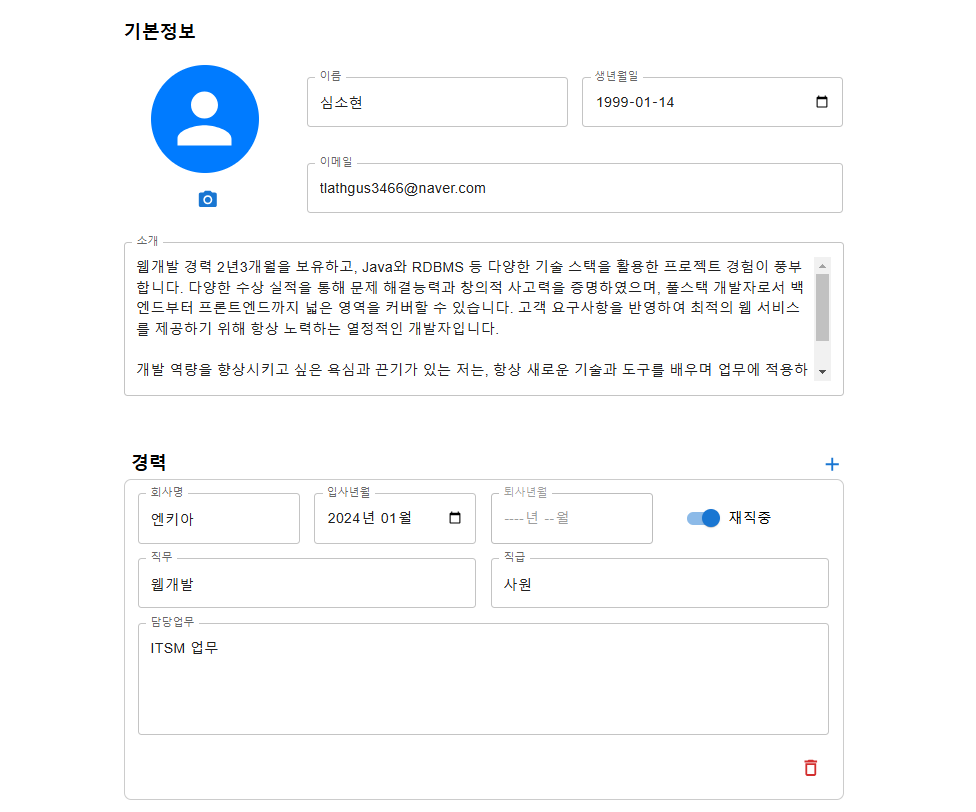
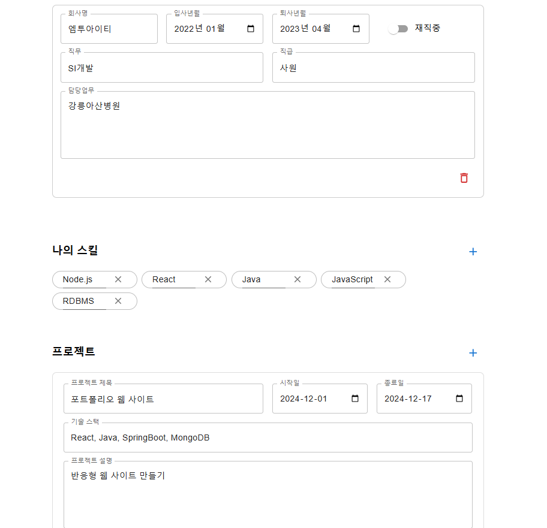
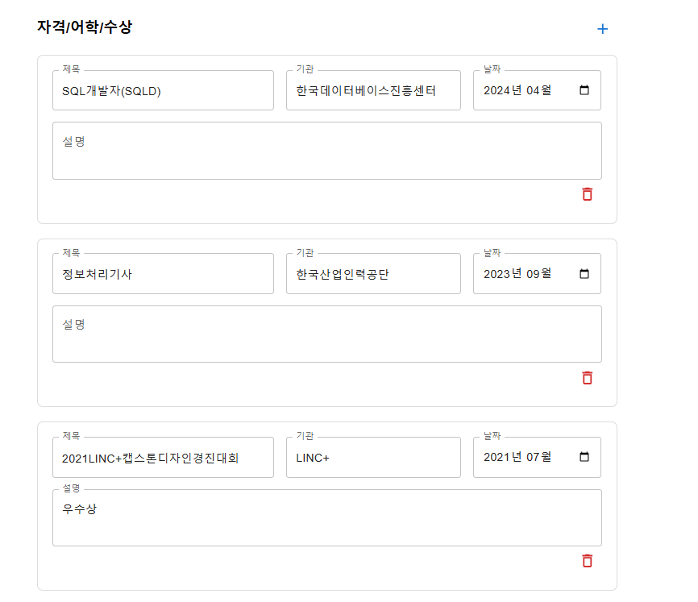
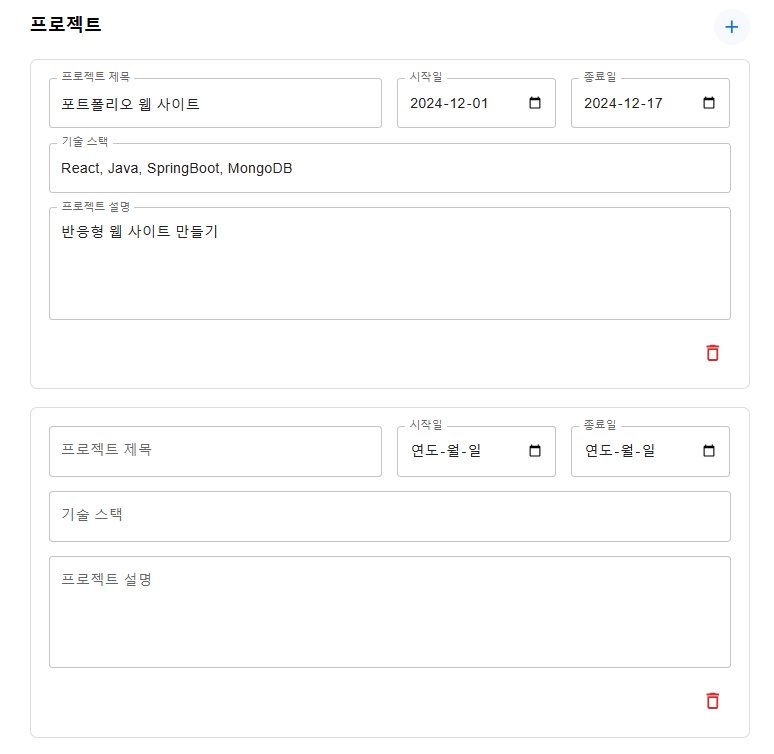
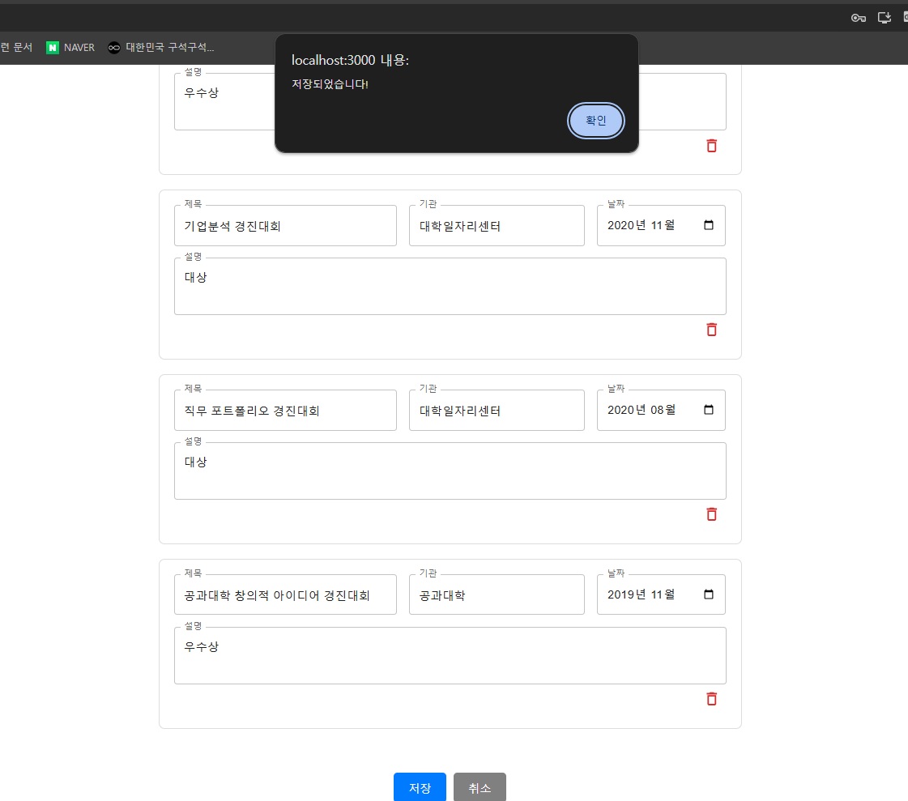

## 소개
 React, Java, MongoDB 사용하여, 데이터 관리를 하고 포트폴리오를 조회할 수 있도록 반응형 웹 페이지 프로젝트

## 개발환경 
- Front : React, MUI
- Back-end : Java, SpringBoot
- 버전관리 : Github

## 개발기간 
- 2024.12.01 ~ 2024.12.17 

## 주요기능 
- 반응형 웹 홈페이지로, PC와 모바일에서 확인, 수정 가능
- 비밀번호 RSA 방식으로 인증
- 리스트는 Drag&Drop 으로 순서 정렬 가능

## 화면구성 
#### 화면조회

#### 비밀번호 팝업 

#### 화면수정 

#### 컴포넌트 추가

#### 컴포넌트 저장

#### 모바일 화면 조회